#### This file is hosted at: [bit.ly/biol266f19](http://bit.ly/biol266f19)

# Getting started

To get started, open your web browser, head to [rstudio.cloud]() and log in using your RStudio Cloud account.

Once you have logged in, start a **New Project** by clicking the button to the right of "Your Projects"

```{r show-new-project-image, echo=FALSE, out.width="800px"}

library('cowplot')
```

After you click the button, **rstudio.cloud** will deploy a new RStudio instance, which may take a minute or two, so be patient.

Once the RStudio instance is running, rename your project by clicking on the "Untitled Project" label at the top of the screen. Give the project a useful name, such as "biol 266".

```{r show-rename-project-image, echo=FALSE, out.width="450px"}

```

## Opening a new script window

It is good practice to enter your R code into a R script. An R script is a plain text file that we save with the extension `.R`. All your code for the lab should go in here because

1. you can save the file and all your work as you go along so you have a record of what you did,
2. it is easier to edit your code and fix errors, mistakes, or typos in the script window, and
3. you can share the script file if you need help to track down an error.

To start a new script, go to the **File** menu, then select **New File** > **R Script**

```{r show-new-script-image, echo=FALSE, out.width="500px"}
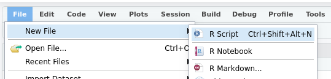
```

Or you can press <kbd>Ctrl</kbd> + <kbd>Shift</kbd> + <kbd>Alt</kbd> + <kbd>N</kbd> on Windows or <kbd>Cmd</kbd> + <kbd>Shift</kbd> + <kbd>Option</kbd> + <kbd>N</kbd> on a Mac.

Your RStudio screen should look like this

```{r show-studio-cloud-image, echo=FALSE, out.width="750px"}
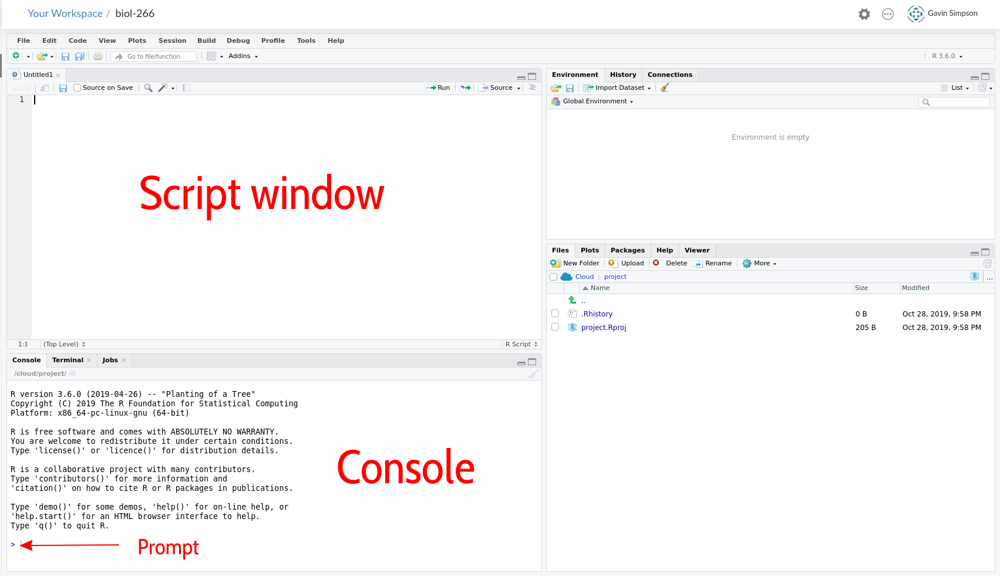
```

## Installing R Packages

Once you have a new session running and named, click in the Console window by the **prompt** and run the code below by typing in the console exactly what is shown below and hitting <kbd>Return</kbd>

```{r install-pkgs, eval = FALSE}
install.packages(c('readxl', 'tidyr', 'dplyr', 'forcats', 'ggplot2', 'emmeans'))
```

This will take a few minutes to complete.

## Load Packages

We need to load the packages we just installed so they are ready to use. You need to do this each time you start R and want to use these packages. The installation step you just performed does *not* need to be each time you start R.

Click in the **script** window. Enter the lines of code below into the script window. The hash character `#` allows you to enter comments, which R will ignore.

```{r load-packages, results = "hide"}
library('readxl')  # read from Excel sheets
library('tidyr')   # data processing
library('dplyr')   # mo data processing
library('forcats') # mo mo data processing
library('ggplot2') # plotting
library('emmeans') # for post hoc comparisons

theme_set(theme_bw()) # Set plot theme
```

Once you have entered all those lines of code into the script window, move the cursor to the first line or click on it, and then press the following keys:

* On Windows press <kbd>Ctrl</kbd> + <kbd>Enter</kbd>
* On Mac press <kbd>Cmd</kbd> + <kbd>Enter</kbd>

This will send the current line of code to the **console** window and move cursor to the start of the next line. Continue hitting <kbd>Ctrl</kbd> + <kbd>Enter</kbd> or <kbd>Cmd</kbd> + <kbd>Enter</kbd> until you have sent each line of code into the console. As you do so, R will load each package; some messages will be printed to the console, but this is OK as long as you do not see any **Errors**.

From now on, enter the code in the shaded grey boxes into the **Script** window and use <kbd>Ctrl</kbd> + <kbd>Enter</kbd> or <kbd>Cmd</kbd> + <kbd>Enter</kbd> to send the code to the **Console**. Whenever R produces output, it should match (or be similar to; you will see output for your data) the text shown in the outlined boxes where each line starts with `##`.

*Note that the output in the console **won't** have the* `##`*, these are just to indicate **output** in this document.*

## Upload data

Before we can work with the data from the experiment, we will need to upload them to our **rstudio.cloud** project. Make sure you have downloaded the `f19ph.xlsx` file from UR Courses and that you have it somewhere on your local computer. Next, make sure the **Files** tab is selected in the lower right quarter of the application, and locate the **Upload** button

```{r show-studio-cloud-upload-button, echo=FALSE, out.width="750px"}
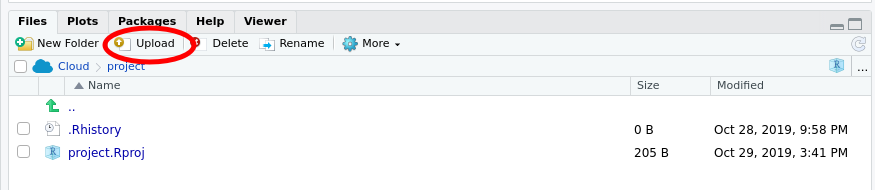
```

Click the **Upload** button --- this will bring up the **Upload files** dialogue box

```{r show-studio-cloud-upload-dialog, echo=FALSE, out.width="350px"}
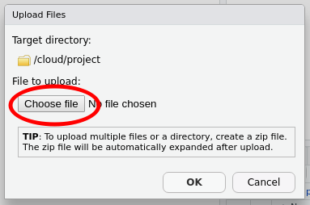
```

Click the **Choose file** button --- this will bring up the file chooser on your computer. In the file chooser, navigate to where you saved the `f19ph.xlsx` file and open it in the chooser so that the file is listed next to the **Choose file** button, as shown below

```{r show-studio-cloud-upload-dialog-filled, echo=FALSE, out.width="350px"}
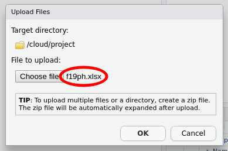
```

Once you have `f19ph.xlsx` showing in the dialogue box, you can click **OK** to upload the file to **rstudio.cloud**.

When you have uploaded the file, your **Files** pane should list the `f19ph.xlsx` file as shown below

```{r show-studio-cloud-upload-complete, echo=FALSE, out.width="750px"}
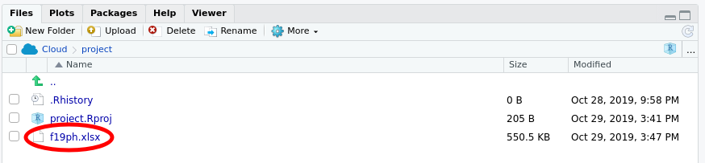
```

## Saving your work

At this point, it is worth saving your script. Find the single disk icons in the main menu or the menu for your script

```{r show-studio-cloud-save-script, echo=FALSE, out.width="750px"}
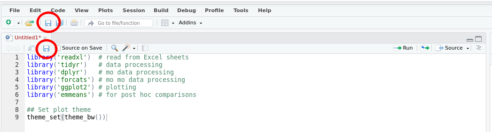
```

Click either of these icons to save the file. The first time you do this you'll be prompted to enter a file name --- use something memorable and be sure to give it the extension `.R`. In the image below I named my script `biol266.R`.

```{r show-studio-cloud-save-dialog, echo=FALSE, out.width="350px"}
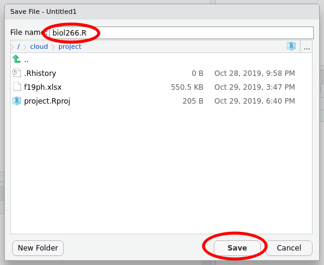
```

Then click **Save**.

Be sure to save your work regularly during class. You can use <kbd>Ctrl</kbd> + <kbd>s</kbd> on Windows and <kbd>Cmd</kbd> + <kbd>s</kbd> on Mac to save changes you make to your script, or click on the disk icon as before.

# Load Data

The experimental data exist in `f19ph.xlsx`, an Excel workbook. The example data I'll use here are in two of the sheets in this workbook. *You will need to know what number your sheets are in this file.*

First we'll read in the data for the wild type cultivar using the `read_excel()` function

```{r load-data, echo = FALSE}
col_types <- rep(c('text','numeric'), times = c(3, 9))
wt <- read_excel('f18ph.xls', sheet = 1, col_types = col_types)
```
```{r fake-loading-data, eval = FALSE}
col_types <- rep(c('text','numeric'), times = c(3, 9))
wt <- read_excel('f19ph.xlsx', sheet = 2, col_types = col_types)
```

To avoid reading in incorrect data, we tell `read_excel()` what types of data to expect in each column of the sheet we read in --- there are three text columns, followed by nine columns of numbers.

If there were no errors or messages printed to the screen then the data were loaded into R. Take a look at the data by typing the name of the object (`wt`) and hitting <kbd>Return</kbd>

```{r look-at-wt}
wt
```

Your data should look similar to the output above. Namely, the example data are in a data frame with `r nrow(wt)` rows and `r ncol(wt)` columns.

The column names contain *data*; we want to extract the variable (`height`, `internodes` etc) as well as the day of each observation from the column names. The variable name and the day of observation are separated by a colon `:` in each column name.

## Data formats

The data are also in what we call *wide* format --- where multiple observations are in a row --- but to fit a statistical model we need them in *long* format --- where each row corresponds to a single observation.

```{r include-wide-long-image, echo = FALSE}
knitr::include_graphics('./images/original-dfs-tidy.png')
```

## Pivoting

We need to convert the data into *long* format and extract the variable and day information from the column names as we do the conversion. This operation of going from *wide* to *long* (or the reverse) is more commonly known as a *pivot*.

The first three columns don't contain data (actual measurements). These columns are useful meta data, but we do not need to pivot those columns, so we'll exclude them from the pivot.

```{r include-wide-long-gif, echo = FALSE}
knitr::include_graphics('./images/tidyr-longer-wider.gif')
```

As we want to pivot to the *long* format we use the `pivot_longer()` function. In the code block below we pass five arguments:

1. `wt` --- this is the name of the object we want to pivot,
2. `-(treatment:plantid)` --- we don't want to pivot those columns, so we *exclude* them by name
3. `names_to = c('variable','day')` --- we want to create new columns with the names *variable* and *day*
4. `names_sep = ':'` --- the variable name and day information are in the column names separated by `:`
5. `names_ptypes = list(day = integer())` --- we want the created `day` column to contain integer values not text

```{r pivot-wt}
wt <- pivot_longer(wt,
                   -(treatment:plantid),
                   names_to = c('variable','day'),
                   names_sep = ':',
                   names_ptypes = list(day = integer()))
```

Take a look at what we have created

```{r look-wt-long}
wt
```

Now we have some new columns in addition to the three columns we *did not* pivot

1. `variable` --- what was measured?
2. `day` --- when was it measured?
3. `value` --- what value did you write down for this measurement?

We have one more data processing step to perform to get the required format for the analysis. We want separate columns for the different types of variable we measured (`height`, `internodes`, `freshwt`). At the moment these are all contained in the single column `variable`. To get the format we want, we need to pivot from this long format back to a wide format, which we do using the `pivot_wider()` function.

```{r pivot-wt-wider}
wt <- pivot_wider(wt, names_from = variable, values_from = value)
```

As well as the name of the object we want to pivot (`wt`), we have to tell `pivot_wider()` which column contains the information for the new column names (the `names_from` argument), and which column contains the data or values (the `values_from` argument). Remember that the `variable` column contains the names of each variable you measured and the `value` column contains the measurement values.

Look at the result

```{r look-wt-wider}
wt
```

We now have columns of data for `height`, `internodes`, & `freshwt`. The `NA` values in `freshwt` are indicators of *missing* *data* because you only measured the fresh weight of the plants on day 21.

To load in the dwarf cultivar data we repeat these steps

1. reading in the data,
2. pivoting from wide to long format and extracting the variable name and day information from the column headers
3. pivoting from long to wide format to create a column of data for each of three variables you measured

```{r fake-loading-pivot-dwarf, eval = FALSE}
dwarf <- read_excel('f19ph.xlsx', sheet = 4, col_types = col_types)
dwarf <- pivot_longer(dwarf, -(1:3), names_sep = ':',
                      names_to = c('variable','day'),
                      names_ptypes = list(day = integer()))
dwarf <- pivot_wider(dwarf, names_from = variable, values_from = value)
dwarf
```
```{r load-pivot-dwarf, echo = FALSE}
dwarf <- read_excel('f18ph.xls', sheet = 4, col_types = col_types)
dwarf <- pivot_longer(dwarf, -(1:3), names_sep = ':',
                      names_to = c('variable','day'),
                      names_ptypes = list(day = integer()))
dwarf <- pivot_wider(dwarf, names_from = variable, values_from = value)
dwarf
```

Now that we have the data as we'd like it, we need to stick the two objects together, which we do with `bind-rows()`

```{r bind-cultivars}
plant <- bind_rows(wt, dwarf)
```

So that we can draw growth lines for each individual plant, we need a unique identifier for each plant. We can achieve that by concatenating or pasting together the `cultivar`, `treatment` and `plantid` information, separated by underscores `_`

```{r plant-id}
plant <- mutate(plant, id = paste(cultivar, treatment, plantid, sep = '_'))
```

One final data processing step involves getting the coding for the `treatment` variable right so that the *control* treatment is the reference level against which the other treatments will be compared. Changing the reference level of a factor (a categorical variable) is known as *releveling*. We change the reference levels using

```{r relevel-treatment}
plant <- mutate(plant, treatment = fct_relevel(treatment, 'control'))
```

OK, that's a lot of data processing. Let's look at the data.

# Fresh weight on day 21

We'll start by taking a look at the fresh weight of the plants on day 21. One way to look at these data is as box plots of the weights for each combination of `cultivar` and `treatment`. To plot the data we'll use the powerful **ggplot2** package and the function `ggplot()`. To draw our plot we need to tell `ggplot()` the following information

1. the name of the object that contains the data we want to plot; in our case this is `plant`
2. we need to *map* variables in `plant` to the axes and other visual attributes, here `colour`
    * we want the `treatment` data on the *x* axis,
	* we want the plant fresh weights (`freshwt`) on the *y* axis,
	* we want to distinguish between the wild type and dwarf cultivar using colour
3. we need to add a layer to the plot that actually draws the box plots using `geom_boxplot()`, and
4. we need to add some proper axis labels, using `labs()`

Notice how we add layers and features to the plot using the `+` operator at the end of statement.

```{r fresh-wt-boxplot}
ggplot(data = plant, mapping = aes(x = treatment, y = freshwt, colour = cultivar)) +
    geom_boxplot() +
    labs(y = 'Fresh weight (g)', x = 'Treatment', colour = "Cultivar")
```

You can ignore the *warning* about removing some rows with missing data. If you get other warnings or your plot doesn't look similar to the one above, double check your code for typos and if you're still stuck ask for help.

Look at the plot you just drew and think about what the data might be telling you about

* how the various treatments might have affected the fresh weight (as a surrogate for plant biomass or size),
* whether all the treatments affected the plants in the same way, and
* whether the treatments affected the two cultivars in similar or different ways?

## ANOVA

The way we plotted the data gives us a guide as to how to approach answering the questions you were just asked to think about. We have a *response* variable --- the fresh weight of each plant on day 21, `freshwt` --- also known as the *dependent* variable. We also have two *independent* variables that define the experimental design:

1. the various control and treatments applied to the plants, `treatment`, and
2. the type of cultivar that each plant belongs to.

The model we want to fit is a special case of a linear model that is commonly known as an *analysis of variance* or *ANOVA*.

### Potential results

It is always worth thinking about the kinds of result we might expect from an statistical analysis. When considering the *fresh weight* data we could think of **four** potential types of result:

```{r anova-hypo-examples, fig.width = 12, fig.height = 7, echo = FALSE, dpi = 120}
df <- tibble(cultivar = factor(rep(c('wt','dwarf'), each = 4),
                               levels = c('wt','dwarf')),
             treatment = factor(rep(c('control','b9','ga10','ga75'), times = 2),
                                levels = c('control','b9','ga10','ga75')),
             hypo1 = rep(4, 8),
             hypo2 = rep(c(8,4), each = 4),
             hypo3 = rep(c(4,2,6,8), times = 2),
             hypo4 = c(4,3,6.5,10, 3,1.25,4,5.5))
labels <- labs(x = NULL, y = 'Fresh weight (g)', colour = 'Cultivar', shape = 'Cultivar')
leg_hor <- theme(legend.position = 'bottom')
no_leg  <- theme(legend.position = 'none')
p1 <- ggplot(df, aes(x = treatment, y = hypo1, colour = cultivar, shape = cultivar)) +
    geom_point(position = position_dodge(width = 0.5), size = 4) +
    labels + labs(title = 'No effects') + leg_hor
p2 <- ggplot(df, aes(x = treatment, y = hypo2, colour = cultivar, shape = cultivar)) +
    geom_point(position = position_dodge(width = 0.5), size = 4) +
    labels + labs(title = 'Cultivar effect; no treatment effect') +
    coord_cartesian(ylim = c(10, 2)) + leg_hor
p3 <- ggplot(df, aes(x = treatment, y = hypo3, colour = cultivar, shape = cultivar)) +
    geom_point(position = position_dodge(width = 0.5), size = 4) +
    labels + labs(title = 'Treatment effect; no cultivar effect') + leg_hor
p4 <- ggplot(df, aes(x = treatment, y = hypo4, colour = cultivar, shape = cultivar)) +
    geom_point(position = position_dodge(width = 0.5), size = 4) +
    labels + labs(title = 'Treatment effect varies with cultivar effect') + leg_hor
legend <- get_legend(p4)
pg1 <- plot_grid(p1 + no_leg, p2 + no_leg, p3 + no_leg, p4 + no_leg, ncol = 2, align = 'hv', axis = 'lrtb')
plot_grid(pg1, legend, nrow = 2, rel_heights = c(1, 0.1))
```

We will fit an ANOVA that allows for the most complex result --- different treatment effects in the two cultivars --- but we will look at the model output to see if the results are more consistent with one of the other options.

An ANOVA is a model where the independent variables are **categorical** variables. **Categorical** variables are ones where each value is one option from a set of possible values. For example we might have a variable `car_colour` where each value is one from the set `red`, `blue`, `white`, or `black`. Another example might be a variable `river_flow`, taking values `none`, `low`, `medium`, and `high`. There is no implied ordering in car colour variable so we call this a **nominal** categorical variable. Sometimes you might here people call this kind of variable *qualitative*. Where the variable has an implied ordering, like the `river_flow` example, we call those variables **ordinal** categorical variables. These may also be referred to as *semi-quantitative*. In R, categorical variables are known as *factors*.

Using R we can fit the ANOVA with the `lm()` function. We specify the model structure using a symbolic formula. The formula we'll use is

    freshwt ~ treatment * cultivar

The response (dependent) variable is on the left hand side of the `~` (the tilde symbol). This is the variable we wish to explain. The right hand side of the formula contains the independent variables in the model. We want to allow for *different* effects of the various treatments among the two cultivars --- gibberellic acid might affect the dwarf cultivar more than the wild type, for example. To achieve this in addition to the *main effects* of `treatment` and `cultivar` we need to have the effects of the treatments *interact* with the effects of the cultivar. In R we indicate that we want main effects plus their interaction using the `*` symbol. The only other thing we need to tell R is where to find the variables named in the formula describing the model we want to fit --- we do this using the `data` argument.

Let's fit the ANOVA

```{r fit-freshwt-anova}
fw1 <- lm(freshwt ~ cultivar * treatment, data = plant)
```

We have stored the result of the ANOVA fit in an object named `fw1`. We can summarize the model fit in a couple of ways; first we look at the model summary

```{r freshwt-summary}
summary(fw1)
```

```{r freshwt-summary-saved, echo = FALSE}
summ <- summary(fw1)
fstats <- summ$fstatistic
```

The omnibus (overall) test of the model is summarized in the *F* statistic and its *p* value. Find this information in the output. In the example shown here, the *F* statistic is `r round(fstats[1], 2)` on `r fstats[2]` and `r fstats[3]` degrees of freedom, with a *p* value of `r format.pval(pf(fstats[1], fstats[2], fstats[3], lower.tail = FALSE), eps = 0.0001, scientific = FALSE)`. This *p* value indicates that it would quite unlikely --- less than 1 in 10,000 --- that we would have observed these differences between cultivars and treatments if there were *no differences* between cultivars and treatments.

This test gives us some gross information about the combined effects of the treatments on the cultivars, but it doesn't provide much detail on which treatments differ and whether there are different treatment effects in the two cultivars. To answer these questions we'll need to do some further processing of the model to compute what are known as *estimated marginal means*.

## Treatments vs controls

The first test we might do is to compare each treatment with the control plants. This involves calculating from the model the *difference* between each level of the treatment and the control. These estimated differences are uncertain so we can express this uncertainty using a confidence interval. Additionally we can do a statistical test of the null hypothesis that the difference is equal to **0** --- which is the same as testing the null hypothesis of equal effects. Because the treatment effect is *nested* within the cultivar effect, we will estimate the difference separately for each cultivar.

```{r fw-trt-ctrl-emm}
fw1mm <- emmeans(fw1, trt.vs.ctrl ~ treatment | cultivar)
```

We saved the result of the `emmeans()` in an object named `fw1mm`. To show the estimated marginal means we type the name of the object and hit <kbd>Return</kbd>

```{r print-fw-trt-ctrl-emm}
fw1mm
```

The output is in two parts:

1. `$emmeans` shows the estimated marginal means of `freshwt` for each level of `treatment` in each of the two cultivars, and
2. `$contrasts` shows the comparison between each treatment level and the control, separately for each cultivar.

In the first part (`$emmeans`) the column labelled `emmean` is the estimated marginal mean for each level of the treatment, whilst `SE` is the standard error --- a measure of uncertainty in the estimated value --- of the `emmean`. The `df` column indicates the degrees of freedom for each of the groupings, and the columns labelled `lower.CL` and `upper.CL` contain the lower and upper limits of the confidence interval, for the stated confidence level (here is it the 95% or 0.95 level). The confidence interval is calculated using the `SE` data, with the interval representing the range of uncertainty in the estimated marginal means.

How do you interpret this? Well, the `emmean` columns are the estimated *average* fresh weight of a plant from that particular cultivar under each of the treatments. In the example we can see that treatment with the largest fresh weight for the dwarf cultivar is the `ga10` treatment, whilst it is the `ga75` treatment level in the wild type. In the dwarf cultivar we see that the estimated average fresh weight of a plant treated with `b9` is slightly *lower* than the average for the control plants.

The kind of comparisons we just made are relatively informal. The `$contrasts` part of the output shows results of more formal comparisons with actual statistical tests comparing each treatment with the control. Note that the *p* values have been adjusted to account for there being *three* tests in each cultivar --- this means the results shown account for the uncertainty that arises due to doing multiple tests.

Look back at the *p* values in the output above. **Are any of the comparisons between treatment and control significantly different from 0 (assume a 95% or 0.95 level of confidence)?**

We can plot the estimated marginal means using the `plot()` method, which might make it easier to see what the table of results means:

```{r plot-trt-ctrl-emms}
plot(fw1mm, comparisons = TRUE)
```

The plot shows the values from the `emmean` column as the black points, while the confidence interval is represented by the pale blue bars. The red arrows are *comparison arrows*, which were added using `comparisons = TRUE`. Take any pair of points; whether the arrows overlap is an *approximate* indication of whether, at the 95% or 0.95 level, the pair of points are *significantly different from one another*. If the arrows *do not* overlap for a pair of points we can conclude that the mean fresh weight of the plants is different between the pair of treatments.

## Pairwise comparisons

We can do the statistical tests implied by the *comparison arrows* using the `emmeans()` function but asking for *pairwise comparisons* instead of *treatment vs control* comparisons. This is done using the `pairwise` option. 

```{r fw-pairwise-by-cultivar}
emmeans(fw1, pairwise ~ treatment | cultivar)
```

Again we get the two types of output and the `$emmeans` part is identical to the one we saw before (we're estimating the same marginal mean fresh weight for each treatment). What is different is the `$contrasts` section, which now contains comparisons between all pairs of treatments for each cultivar. Again the *p* values have been adjusted to account for the multiple tests that were performed.

**Are any of the pairwise comparisons significantly different?**

We can compare differences between cultivars for each level of the treatment using a similar approach:

```{r fw-pairwise-by-treatment}
emmeans(fw1, pairwise ~ cultivar | treatment)
```

This time we get a different `$emmeans` section as we are now estimating the marginal mean fresh weight for each cultivar, for each level of the treatment. The `$contrasts` section now contains a single comparison for each treatment level as we only have a single pair of cultivars.

**Are any of these pairwise comparisons significantly different?**  **What does this suggest about the effects of the treatment and the cultivar on the fresh weight of the plants?**

# Plant height

We can plot the plant height data over time using the following code

```{r plot-height-data}
ggplot(plant, aes(x = day, y = height, group = id, colour = treatment)) +
    geom_point() +
    geom_line() +
    facet_wrap(~ cultivar) +
    labs(y = 'Height (mm)', x = 'Day', colour = 'Treatment')
```

As before, we specify the data and the mapping of variables to axes and the colour channel. One difference here is that as we want to group the data for each plant and draw lines through the observations to better show how the height of each plant changed over time. We indicate this grouping via the `group` aesthetic, which we set to the `id` variable we created earlier.

This plot has two layers:

1. a point layer (`geom_point()`), and
2. a line layer (`geom_line()`)

We also draw the data for the two cultivars in it's own panel, which *ggplot* calls *faceting*. The final line adds some nice labels to the plot.

## ANCOVA

The model we are fitting is sometimes called an *analysis of covariance* or ANCOVA, which is another special case of a linear model that can also be fitted using the `lm()` function. In an ANCOVA, we *control* for the effects of a continuous variable whilst interest is on a categorical treatment effect.

### Potential results

As before, it is helpful to think about the kinds of result we might expect from the statistical analysis. When considering the *plan height* data we could think of **five** basic types of result:

```{r ancova-hypo-examples, fig.width = 12, fig.height = 10.5, echo = FALSE, dpi = 120}
df <- crossing(##cultivar  = factor(c('wt','dwarf'), levels = c('wt','dwarf')),
               day       = c(0,7,14,21),
               treatment = factor(c('control','b9','ga10','ga75'),
                                  levels = c('control','b9','ga10','ga75')))
f1 <- function(df) {
    rep(4, nrow(df))
}
f2 <- function(df) {
    rep(4, nrow(df)) + (1.5 * df$day)
}
f3 <- function(df) {
    x <- df$treatment
    treat_eff <- case_when(
        x == 'control' ~ 0,
        x == 'b9'      ~ -4,
        x == 'ga10'    ~ +4,
        x == 'ga75'    ~ +8)
    rep(4, nrow(df)) + (1.5 * df$day) + treat_eff
}
f4 <- function(df) {
    x <- df$treatment
    treat_eff <- case_when(
        x == 'control' ~ 0,
        x == 'b9'      ~ -4,
        x == 'ga10'    ~ +4,
        x == 'ga75'    ~ +8)
    interact <- case_when(
        x == 'control' ~ 0,
        x == 'b9'      ~ -1,
        x == 'ga10'    ~ +1,
        x == 'ga75'    ~ +2)
    rep(4, nrow(df)) + (1.5 * df$day) + treat_eff + (interact * df$day)
}
f5 <- function(df) {
    x <- df$treatment
    treat_eff <- case_when(
        x == 'control' ~ 0,
        x == 'b9'      ~ -2,
        x == 'ga10'    ~ +2,
        x == 'ga75'    ~ +4)
    rep(4, nrow(df)) + (0 * df$day) + treat_eff
}

df <- mutate(df,
             hypo1 = f1(df),
             hypo2 = f2(df),
             hypo3 = f3(df),
             hypo4 = f4(df),
             hypo5 = f5(df))

labels <- labs(x = NULL, y = 'Height (mm)', colour = 'Treatment')
leg_hor <- theme(legend.position = 'bottom')
no_leg  <- theme(legend.position = 'none')
p1 <- ggplot(df, aes(x = day, y = hypo1, colour = treatment)) +
    geom_line() +
    geom_point(size = 2) +
    labels + labs(title = 'No effects') + leg_hor
p2 <- ggplot(df, aes(x = day, y = hypo2, colour = treatment)) +
    geom_line() +
    geom_point(size = 2) +
    labels + labs(title = 'Day effect; no treatment effect') + leg_hor
p3 <- ggplot(df, aes(x = day, y = hypo3, colour = treatment)) +
    geom_line() +
    geom_point(size = 2) +
    labels + labs(title = 'Additive Day and Treatment effects') + leg_hor
p4 <- ggplot(df, aes(x = day, y = hypo4, colour = treatment)) +
    geom_line() +
    geom_point(size = 2) +
    labels + labs(title = 'Day effect varies with treatment') + leg_hor
p5 <- ggplot(df, aes(x = day, y = hypo5, colour = treatment)) +
    geom_line() +
    geom_point(size = 2) +
    labels + labs(title = 'Treatment effect; no day effect') + leg_hor
legend <- get_legend(p5)
pg1 <- plot_grid(p1 + no_leg, p2 + no_leg, p5 + no_leg, p3 + no_leg, p4 + no_leg,
                 ncol = 2, align = 'hv', axis = 'lrtb')
plot_grid(pg1, legend, nrow = 2, rel_heights = c(1, 0.1))
```

In addition, *some* or *all* of the above effects could be either

* the same in both the wild-type and dwarf mutant cultivars, or
* they could differ between the wild-type and the dwarf mutant cultivars.

We specify the model structure using a symbolic formula. The formula we'll use is

    height ~ day * treatment * cultivar

The response (dependent) variable is on the left hand side of the `~` (the tilde symbol). This is the variable we wish to explain. The right hand side of the formula contains the independent variables in the model. Here, the independent variables represent the experimental setup.

Given our experimental design, the most complex model we can fit is one that allows for different growth rates (effects of `day`) for each treatment level for each cultivar. In other words we want to have a different growth rate for each combination of treatment and cultivar.

Such a model implies a three-way interaction between `day`, `treatment`, and `cultivar`. We indicate interactions in the formula using the `*` symbol.

```{r fit-model}
h1 <- lm(height ~ day * treatment * cultivar, data = plant)
```

We can summarize the model to look for some key diagnostics of the fit

```{r height-summary}
summary(h1)
```

Most of this isn't very helpful in this state, except the omnibus *F* test which indicates if the total variance explained by all the model terms is significantly large relative to the unexplained variance.

## Treatments vs controls

To get more interpretable output we will again use estimate marginal means, but with one slight difference; this time we are interested in the linear effect of `day`, a continuous variable, as well as the treatment and cultivar effects. The `day` effect will be represented by straight lines (regression lines), the slopes of which reflect the average growth rate of plants in the combinations of treatments and cultivars. These lines are often called *trends* hence we use the `emtrends()` function to estimate the marginal trends instead of the marginal means.

As before we will start by comparing the treated plants with the control plants. This time however we need to indicate the *trend* variable via argument `var`. In our case the trend variable is `day` (which is indicated by the name in quotes)

```{r treatment-v-control-by-cultivar}
h1mm <- emtrends(h1, trt.vs.ctrl ~ treatment | cultivar, var = "day")
h1mm
```

You should be familiar with this output now. The `$emtrends` section contains similar outputs to the `$emmeans` sections we looked at earlier when analyzing the fresh weight of the plants. The main difference is in the interpretation of the numbers in the `day.trend` column, which replaces the `emmean` from before. The `day.trend` column contains estimates of the slope of the regression line for the `day` variable.

The numbers in the column are the estimated *change in the height* of the plant for a single day of growth:

* If the `day.trend` number is positive it means the plants in a treatment group increased in height over the experiment, and
* if the `day.trend` number is negative it means the plants in a treatment group decreased in height over the experiment.

The `$contrasts` section contains the same kind of comparisons of a treatments vs controls. Remember here that the `estimate` column contains the estimated difference in the slopes (growth rates) of the stated treatment and the control group. Hence the null hypothesis being tested is that the *difference in slopes is equal to zero*.

* A negative value in the `estimate` column means the average change in height in the stated treatment was lower than in the control group. In other words, the plants in that treatment group grew *more slowly* on average than the plants in the control group, and
* A positive value in the `estimate` column means the plants in the that treatment group grew, on average, at a faster rate than plants in the control group.

As before, we can plot these estimated marginal trends using the `plot()` method:

```{r plot-treatment-v-control-by-cultivar}
plot(h1mm, comparisons = TRUE)
```

This plot is similar to one we created earlier when we looked at the fresh weight of the plants:

* the black points are the estimated growth rates (regression slopes) for each treatment group,
* the 95% confidence interval around the estimated growth rate is shown by the pale blue bar, and
* the red arrows are approximate pairwise comparison regions --- if arrows for a pair of treatments overlap one another we fail to reject the null hypothesis of equal growth rates for plants in the two treatments.

The main difference in this plot is that we no longer show the estimated marginal mean on the *x* axis. Instead the slope of the regression line (the growth rate) is plotted on the *x* axis. Remember how we interpret these numbers: the values are the estimated *change*, on average, in the height of a plant in single day of growth.

All this talk of estimated trends or slopes may be a little opaque, but we can plot the estimated regression lines to visualize the average growth rates of plants in each of the treatment groups using the `emmip()` function:

```{r height-plot-estimated-slopes}
emmip(h1, treatment ~ day | cultivar, cov.reduce = FALSE, CIs = TRUE)
```

Here the formula means you want to show the `treatment` effects against `day` separately for each cultivar. The `cov.reduce = FALSE` part means that we want to plot for all values of `day` so that we get the full regression lines. Confidence intervals are added with `CIs = TRUE` --- if you want to turn them off use `CIs = FALSE`.

## Pairwise comparisons

If you want formal comparisons of the growth rates for all pairs of treatments, we can also do all pairwise comparisons using the `emtrends()` function by using the `pairwise` option instead of `trt-vs-ctrl`. Firstly, we'll compare the growth rates for all pairs of treatment groups, separately for each cultivar

```{r height-pairwise-by-cultivar}
emtrends(h1, pairwise ~ treatment | cultivar, var = "day")$contrasts
```

Here, to save space we only show the pairwise comparisons (the `$contrasts` section) as the `$emtrends` section repeats the one from earlier in this analysis.

If we're interested in comparing the growth rates of the two cultivars, we need to do this separately for each treatment. We can do these comparisons with `emtrends()` by reverting the order in which we specify `treatment` and `cultivar`:

```{r height-pairwise-by-treatment}
emtrends(h1, pairwise ~ cultivar | treatment, var = "day")
```

This time we show the full output as the `$emtrends` section now contains the estimated daily growth rates (the daily change in plant height) for each cultivar in each of the treatment groups.

The `$contrasts` section contains compares the daily change in height of the two cultivars for each treatment group. Remember there is only a single pairwise comparison for each treatment group as we only have two cultivars to compare.

We can visualize the last set of comparisons using the `emmip()` function as we did previously, but now we use a different arrangement of the variables in the formula

```{r plot-emtrends-pairwise-comparisons-of-cultivars}
emmip(h1, cultivar ~ day | treatment, cov.reduce = FALSE, CIs = TRUE)
```

**Are any of these pairwise comparisons statistically significant?**  **What does this suggest about the effects of the treatment and the cultivar on the growth rates of the plants?**

# Number of internodes

Exercise for the students.

# Exporting images & files

To save a plot to a file, click on the **Plots** tab in the lower right window, and use the arrow icons to page through the plots to the one you want. Then click the **Export**

```{r show-studio-cloud-export-1, echo=FALSE, out.width="750px"}
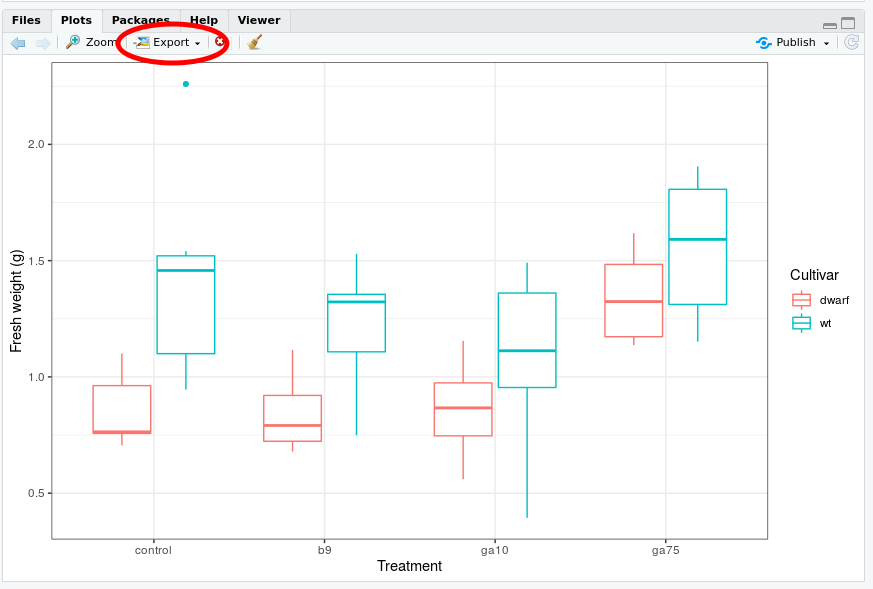
```

From the menu that appears choose **Save as Image...**

```{r show-studio-cloud-export-2, echo=FALSE, out.width="750px"}
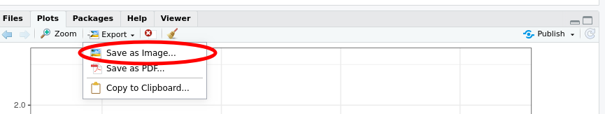
```

This brings up the **Save Plot as Image** dialogue box. Make the following changes:

1. In the *Image format* box, select **PNG**
2. In the *File name* box enter the file name you want for the image, include the `.png` extension
3. Change the height and width to suit
    * You can set the height and width in pixel in the boxes to the top right of the dialogue box. If you change these you need to click the *Update Preview* button to redraw the plot
	* Alternatively, you can use the hotspot to the bottom right corner of the plot to drag to resize. Click the *Update Preview* button to redraw the plot to the desired size

```{r show-studio-cloud-export-3, echo=FALSE, out.width="750px"}
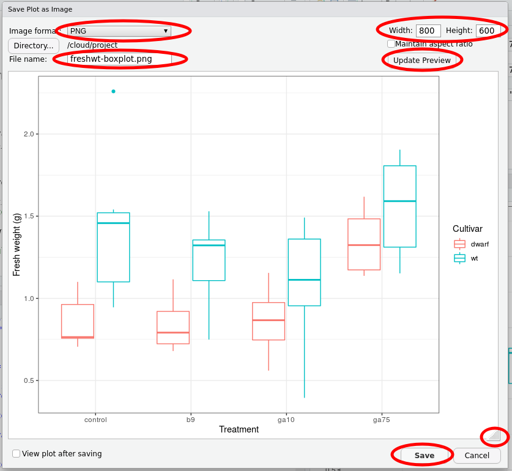
```

When you have made the required changes, click **Save**.

To export saved images or your script to your local machine, select the **Files** tab in the lower right window

```{r show-studio-cloud-export-4, echo=FALSE, out.width="750px"}
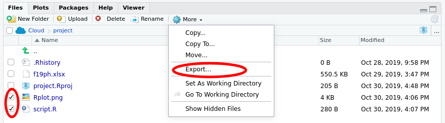
```

Check the boxes next to the files you wish to export (download) as shown above, and then click the **More** button in the menu and select the **Export...** option.

```{r show-studio-cloud-export-5, echo=FALSE, out.width="300px"}
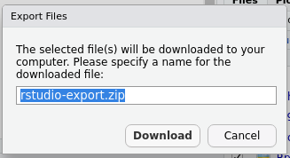
```

Enter a filename --- if you are exporting more than one file, *RStudio* will compress all the files into a single ZIP archive --- if needed, but the provided name should be OK. Then click **Download** to download the file or the ZIP archive.

# Logging Off

Your work will be saved in your **rstudio.cloud** workspace for some time after the lab. You will be able to resume from where you left off if you log in to your workspace at a late time. To be sure that the latest state of your work is saved, it would be best to log out of **rstudio.cloud** at the end of class today.

Locate your user name in the top right of the screen

```{r show-studio-cloud-logout-1, echo=FALSE, out.width="250px"}

```

Click your user name to open the menu

```{r show-studio-cloud-logout-2, echo=FALSE, out.width="500px"}

```

Click "Log out" to securely log out of **rstudio.cloud**.


# Final thoughts

The statistical models shown here are intended to give you a flavour of the sorts of analysis that could be applied to these data. The analysis is necessarily incomplete and simplified because

1. we don't have time in a single lab class to go through all the model evaluation we would need to do to assure ourselves that the inferences --- the estimates from the models and associated intervals and *p* values --- are valid and do not violate the assumptions of the methods we used, and
2. the statistical methods needed to fully analyze these data require techniques you won't begin to cover until you take BIOL 440 *Modelling Biological Data* with Dr. Mark Vanderwel.

Aspects of the data that we haven't considered or simply ignored are:

1. What if the growth of the plants is non-linear? Our models assumed linear growth but if the growth appears to speed up or slow down over the course of the experiment, our model will give biased estimates of the growth rates.

2. We assumed that the individual measurements were independent of one another. However, you repeatedly measured the same plants, within your groups, over the course of the experiment. The observations for any one plant are, all else being equal, more likely to be similar to one another than they are to another plant. The result of repeatedly measuring the same individuals over time is that we have **fewer** observations than is implied by the number of rows in the data set. We would need to use a repeated measures ANOVA or, better still, a mixed modelling approach to account for the lack of independence. If you take BIOL 440 with Dr. Vanderwel you will learn about mixed models.

3. Variables such a plant height and fresh weight are continuous variables. They also have a fixed zero point --- you can't have a plant with negative height or weight (in fact you can't measure a plant with *zero* height or weight either!). Data like this have what we call a *non-constant mean-variance relationship* --- as we increase in height or weight we expect the variation about the mean or expected value to increase. Think about it, if we had a zero height plant there is no variation about that value as there is no plant. Hence as we increase height or weight the spread of the data must increase. This is known as *heteroscedasticity*. Also, we could extrapolate from our linear models and predict negative weight and height plants, which doesn't make sense. The class of models called **generalized linear models** would allow us to handle these features of the data. You'll learn about these models too if you take BIOL 440!
